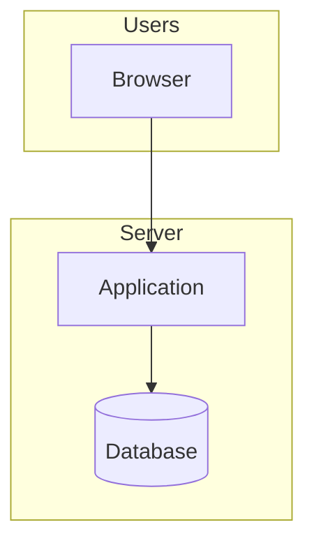
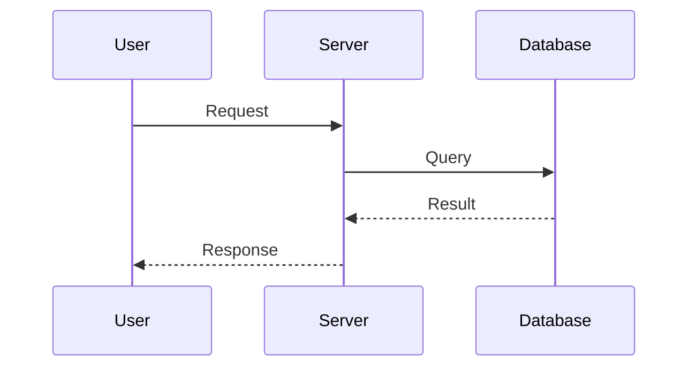
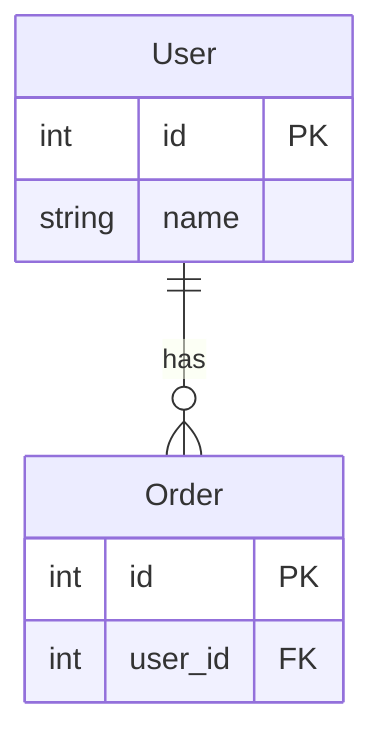

# Project Documentation Auto-Generation Skill

## Overview

This skill analyzes a project's source code and generates the following documents:

1. **Project Overview** (`overview.md`) - what the project does, architecture diagram, core flows
2. **API Reference** (`api-reference.md`) - endpoints list, request/response examples
3. **Setup Guide** (`setup-guide.md`) - prerequisites, setup steps, operational commands, troubleshooting
4. **Index** (`index.md`) - document index and quick start

## Usage

```
/generate-docs [output-directory]
```

If omitted, output defaults to `docs/`.

## Workflow

### Step 1: Understand the project structure

1. Inspect the directory structure
2. Read key files (e.g., `README.md`, `docker-compose.yml`, `requirements.txt`, `package.json`)
3. Identify entry points (e.g., `main.py`, `app.py`, `src/index.ts`)

### Step 2: Analyze the code

1. Extract symbol/structure summaries for major modules
2. Identify integrations (APIs, databases, external services)
3. Collect configuration files and environment variables

### Step 3: Generate documentation

Generate each document following the templates below (full templates: `TEMPLATES.md`).

#### `overview.md` template

```markdown
# {Project Name} - Technical Overview

## 1. Project Overview
### 1.1 Purpose
### 1.2 Key Features
### 1.3 Intended Users

## 2. System Architecture
### 2.1 Architecture Diagram (Mermaid)
### 2.2 Components

## 3. Core Flows
### 3.1 Main Flow (Mermaid sequence diagram)

## 4. Data Model
### 4.1 ER Diagram (Mermaid)
### 4.2 Table/Entity Notes

## 5. Repository Structure
### Directory Tree

## 6. Key Modules
### Responsibilities and important functions/classes

## 7. Environment Variables
### Table format

## 8. Security
### Auth, authorization, encryption

## 9. Operational Notes

## 10. Future Improvements
```

#### `api-reference.md` template

```markdown
# API Reference

## Authentication
### Login / Logout

## Endpoints
### Each endpoint
- method + path
- parameters (table)
- request example
- response example

## Error Responses
### HTTP status codes
```

#### `setup-guide.md` template

```markdown
# Setup & Operations Guide

## 1. Prerequisites
### Required software

## 2. First-time Setup
### Environment variables
### Run commands

## 3. Docker Notes (if applicable)

## 4. Operations
### Container commands
### Database commands

## 5. Troubleshooting
### Common issues and fixes

## 6. Backups

## 7. Production Configuration
### Security checklist
```

## Mermaid diagram rules

### Architecture diagram


### Sequence diagram


### ER diagram


## Output quality rules

1. **Write in English** (keep proper nouns as-is; add Japanese only if explicitly requested)
2. **Use Mermaid diagrams proactively** for visual understanding
3. **Prefer tables** for parameters, env vars, endpoints, etc.
4. **Include runnable examples** when possible (requests, responses, config)
5. **Make it approachable** (explain terms briefly; step-by-step where helpful)

## Notes

- Do not overwrite existing docs (e.g., `README.md`)
- Ensure the output directory exists (create if missing)
- Mask secrets (API keys, tokens) using placeholders like `your-api-key-here`
