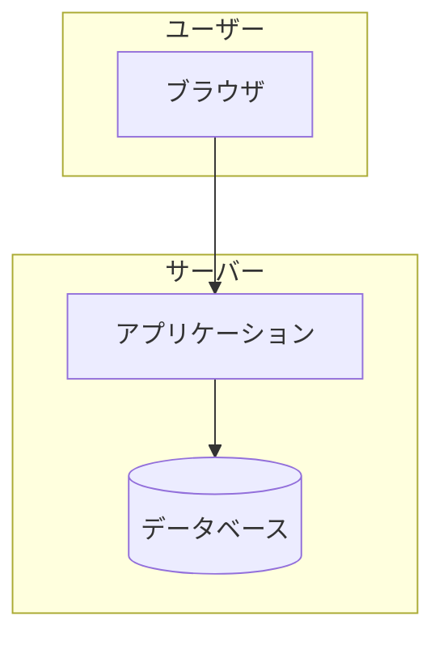
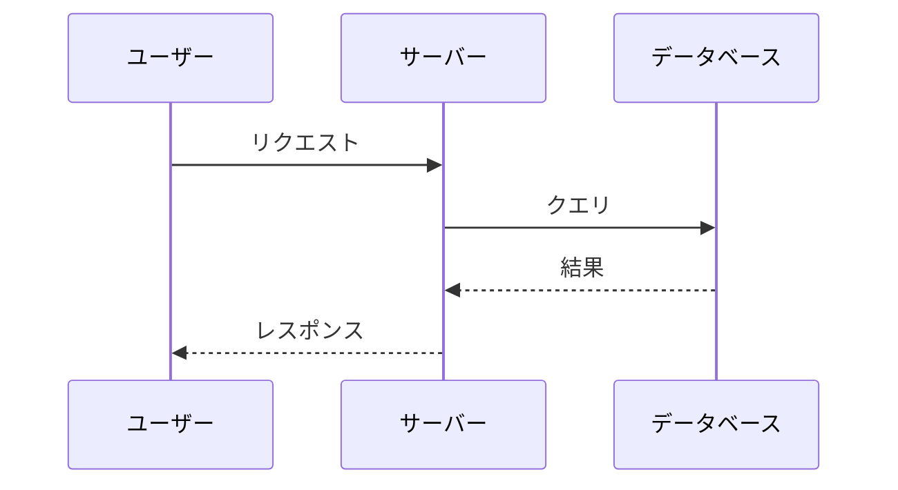
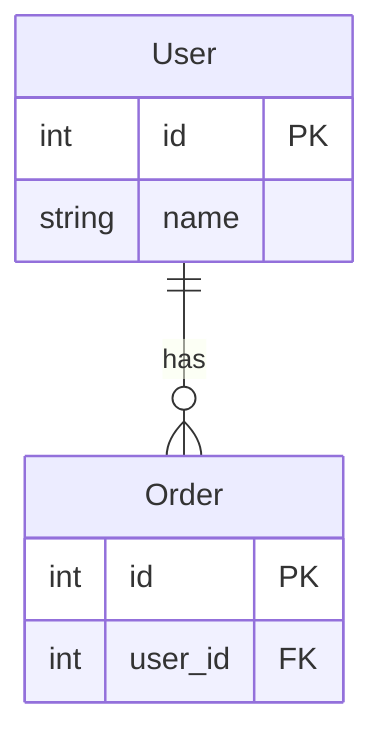

# プロジェクトドキュメント自動生成スキル

## 概要

このスキルは、プロジェクトのソースコードを分析し、以下のドキュメントを自動生成します：

1. **概要解説書** (`overview.md`) - プロジェクト全体の説明、アーキテクチャ図、処理フロー
2. **APIリファレンス** (`api-reference.md`) - エンドポイント一覧、リクエスト/レスポンス例
3. **セットアップガイド** (`setup-guide.md`) - 環境構築、運用コマンド、トラブルシューティング
4. **インデックス** (`index.md`) - ドキュメント一覧とクイックスタート

## 使用方法

```
/generate-docs [出力ディレクトリ]
```

引数が省略された場合は `docs/` に出力します。

## 実行手順

### ステップ1: プロジェクト構造の把握

1. プロジェクトのディレクトリ構造を確認
2. 主要なファイル（README.md, docker-compose.yml, requirements.txt等）を読み込み
3. エントリーポイント（main.py, app.py, index.ts等）を特定

### ステップ2: コード分析

1. 主要モジュールのシンボル概要を取得
2. 外部連携（API、データベース）を特定
3. 設定ファイル・環境変数を収集

### ステップ3: ドキュメント生成

各ドキュメントは以下のテンプレートに従って生成:

#### overview.md テンプレート

```markdown
# {プロジェクト名} 解説書

## 1. プロジェクト概要
### 1.1 目的
### 1.2 主な機能
### 1.3 対象ユーザー

## 2. システム構成
### 2.1 アーキテクチャ図（Mermaid）
### 2.2 コンポーネント一覧

## 3. 処理フロー
### 3.1 主要フロー（Mermaidシーケンス図）

## 4. データモデル
### 4.1 ER図（Mermaid）
### 4.2 テーブル説明

## 5. ファイル構成
### ディレクトリツリー

## 6. 主要モジュール解説
### 各モジュールの役割と主要関数

## 7. 環境変数一覧
### 表形式でまとめ

## 8. セキュリティ
### 認証・権限・暗号化

## 9. 運用時の注意点

## 10. 今後の拡張ポイント
```

#### api-reference.md テンプレート

```markdown
# API リファレンス

## 認証
### ログイン/ログアウト

## エンドポイント一覧
### 各エンドポイント
- メソッド・パス
- パラメータ（表形式）
- リクエスト例
- レスポンス例

## エラーレスポンス
### HTTPステータスコード一覧
```

#### setup-guide.md テンプレート

```markdown
# セットアップ・運用ガイド

## 1. 前提条件
### 必要なソフトウェア

## 2. 初回セットアップ
### 環境変数設定
### 起動コマンド

## 3. Docker環境の注意点

## 4. 運用コマンド
### コンテナ操作
### データベース操作

## 5. トラブルシューティング
### よくあるエラーと対処法

## 6. バックアップ

## 7. 本番環境向け設定
### セキュリティチェックリスト
```

## Mermaid図の生成ルール

### アーキテクチャ図


### シーケンス図


### ER図


## 出力品質のルール

1. **日本語で記述** - 技術用語は適宜英語を併記
2. **Mermaid図を積極的に使用** - 視覚的な理解を促進
3. **表形式を活用** - パラメータ、環境変数、エンドポイント等
4. **コード例を含める** - リクエスト/レスポンス、設定例
5. **初心者にも分かりやすく** - 段階的な説明、用語の解説

## 注意事項

- 既存のドキュメント（README.md等）は上書きしない
- 生成前にdocsディレクトリの存在を確認
- 秘密情報（APIキー等）はマスキング（`your-api-key-here`等）
